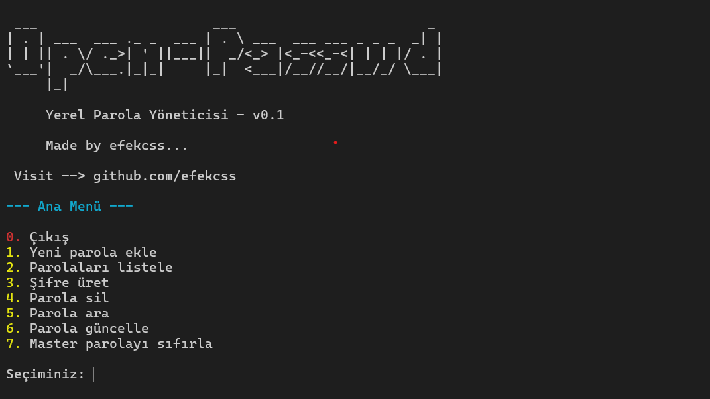

# 🔐 Open-Passwd_v0.1

Terminal üzerinden çalışan basit bir parola yöneticisi. AES şifreleme ile güvenli parola saklama, parola üretme ve yönetme desteği sunar. Parolalarını şifreli bir şekilde rahatça saklayabilirsin.

---

## 📚 İçindekiler
- [🚀 Özellikler](#özellikler)
- [🖥️ Kurulum](#️kurulum)
- [🛠️ Kullanım](#kullanım)
- [📷 Ekran Görüntüsü](#terminal-ekran-görüntüsü)
- [❗ Dikkat](#️dikkat)

---

##  Özellikler

- 🔒 AES (Advanced Encryption Standard) ile güvenli şifreleme
- 🔐 Parola üretimi ve yönetimi

---

##  Kurulum

Uygulamanın kurulum aşamaları adım adım aşağıda verilmiştir. Hiçbir adımı atlamadığınızdan emin olun. Uygulamada terminal bazlı olduğundan gerekli tüm işlemler terminal uygulamasında yapılmalıdır.

### 1. Python Gereksinimi

Python 3.8 veya üzeri bir sürüm sisteminizde kurulu olmalıdır. Aşağıdaki komutla kontrol edebilirsiniz:

```bash
python --version
```
Eğer python sürümünüz 3.8 den daha eski ise ;

- 🪟 **Windows**: [Python.org](https://www.python.org/downloads/)
- 🐧 **Linux**:
 ```bash
 sudo apt install python3.13 #en son sürüm ne ise onu kullanın (şuanlık 3.13 örn: pyton3.13)
 ```
- 🍏 **Mac**:
  ```bash
  brew install python
  ```

---

### 2.Gereksinimleri Kurma

Uygulamanın düzgün çalışması için gerekli paketlerin ve gereksinimlerin kurulması için aşağıdaki kodu çalıştırın:

```bash
pip install -r requirements.txt
```

ya da

```bash
python -m pip install -r requirements.txt
```
şeklinde de gereksinimleri kurabilirsiniz.

---

## Kullanım

Gereksinimleri de kurduktan sonra artık uygulamayı çalıştırabilirsiniz : 
```bash
python main.py
```
NOT: Uygulamaya ilk girdiğinizde "master password" oluşturmanızı isteyecektir girmeniz gerekliki yalnızca siz parolalarınıza erişebilesiniz. Daha sonra "master password"ünüzü unutmanız halinde tekrar parolalarınıza erişebilmek için güvenlik sorusu belirlemeniz gerekicek ve bu sorunun cevabını unutmamalısınız aksi takdirde tekrar giriş yapamazsınız!

Bundan sonraki her kullanımda sadece "master password"ünüzü girerek uygulamayı kullanabileceksiniz.

---

##  Terminal Ekran Görüntüsü

Aşağıda uygulamanın terminal üzerinden nasıl çalıştığını gösteren bir örnek ekran görüntüsü yer almaktadır:



---

##  Dikkat

> İlk kullanım sonrası dosya içerisinde "key.key" , "passwords.json" , "master.key" gibi uygulamaya özgü dosyalar oluşacaktır ve bunların silinmesi, isimlerinin değiştirilmesi halinde maalesef **parolalarınıza tekrar erişiminiz olamayacaktır.**

---

**NOT :**
 Uygulama hala geliştirilme aşamasındaır eksikleri bulunabilir zamanla versiyon güncellemeleri gelecek ve yeni özellikler ile hata düzeltmeleri yayınlanacaktır.

## ✨ Katkı

Katkıda bulunmak isterseniz `pull request` göndermekten çekinmeyin!

---

## 📬 İletişim

Proje hakkında öneri, geri bildirim veya hata bildirimi için:  
📧 `kocasuhasanefe@gmail.com`
